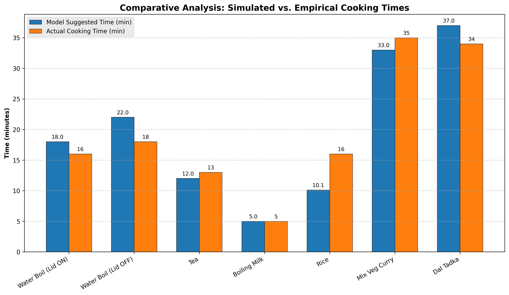
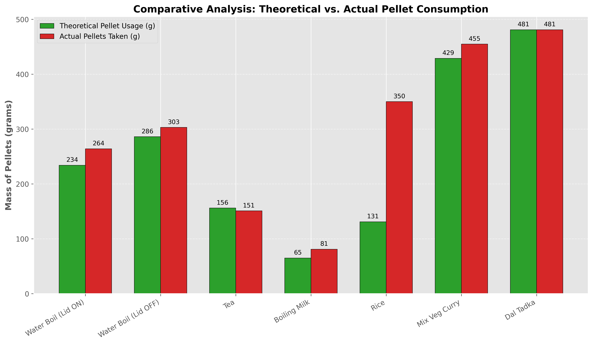
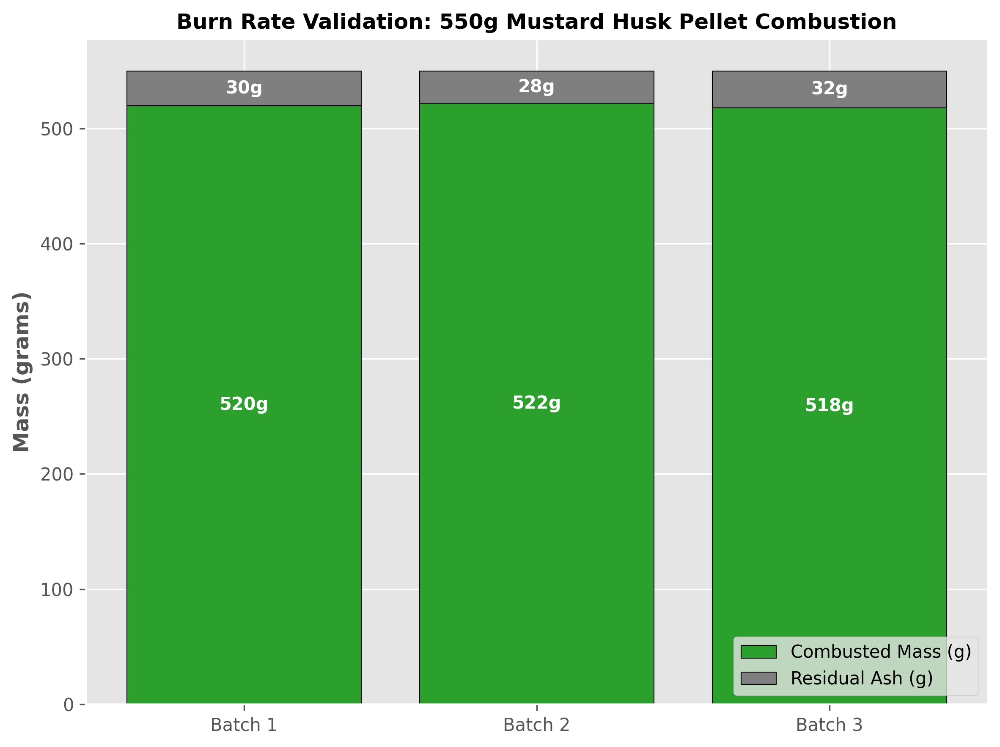

# Laboratory Experimental Validation Report
**Project Phase:** Empirical Model Validation & Burn Rate Standardization
**Fuel Analyzed:** Mustard Husk Pellets
**Apparatus:** Tadka Chulha (Forced Draft Biomass Stove)

---

## 1. Methodology & Apparatus Specifications
To validate the transient physics models driving the cookstove simulator, a series of seven standard cooking experiments and three burn rate verification tests were conducted indoors. 

**Standardized Constants:**
*   **Stove Mass:** 5.350 kg (Tadka Chulha with fan modular attached)
*   **Thermal Efficiency Constant ($\eta$):** 47% (0.47)
*   **Fuel Type:** Mustard Husk Pellets
*   **Calculated Mass Burn Rate ($m_{burn}$):** 0.78 kg/hr (13 g/min)

All cooking experiments recorded ambient temperature, exact utensil mass/capacity, total mass of pellets combusted, and exact time taken to achieve the culinary goal compared against the model's simulated outputs.

---

## 2. Experimental Data & Deviation Analysis

The table below breaks down the deviation between the theoretical simulation and the empirical laboratory results for both **Cooking Time** and **Pellet Consumption**.

| Exp | Dish / Procedure | Utensil Params | Ambient | Time $\Delta$ (Actual vs Model) | Mass $\Delta$ (Actual vs Model) | Empirical Observations / Remarks |
| :--- | :--- | :--- | :--- | :--- | :--- | :--- |
| **1** | Water Boil (Lid ON, 5L) | AL Pot 8L (0.829 kg) | 26°C | **16m** vs 18m (-11.1%) | **264g** vs 234g (+12.8%) | The lid efficiently trapped heat, leading to a faster boil. Total pellet usage slightly higher due to 19m total burn duration despite reaching 99°C at 16m. |
| **2** | Water Boil (Lid OFF, 5L) | AL Pot 8L (0.829 kg) | 24°C | **18m** vs 22m (-18.1%) | **303g** vs 286g (+5.9%) | Repeated runs yielded consistent results (15m/94°C and 17m/96°C). The model's 22m prediction safely overestimates convection heat loss. |
| **3** | Tea (5 servings, 1L) | Kadhai 2.5L (1 kg) | 25°C | **13m** vs 12m (+8.3%) | **151g** vs 156g (-3.2%) | Exceptional alignment. Heat transfer characteristics for small liquid batches in open Kadhais are highly accurate. |
| **4** | Boiling Milk (0.5L) | Kadhai 2.5L (1 kg) | 25°C | **5m** vs 5m (0.0%) | **81g** vs 65g (+24.6%) | Perfect temporal alignment. The new model successfully corrected the previous 8m overestimation by accurately tuning milk's specific heat. |
| **5** | Rice (4 servings, 480g) | Pressure Cooker 2L (1.1 kg) | 25°C | **16m** vs 10.1m (+58.4%) | **350g** vs 131g (+167%) | > [!WARNING]\n> **Critical Failure Mode:** The model perfectly predicted the *first boil* (8m vs 8.5m), but the overall process took 16m and resulted in a burnt bottom. The kinetic simmer phase inside the pressure vessel dehydrated too rapidly, indicating a practical limit on water-to-rice ratios over forced draft stoves. |
| **6** | Mix Veg Curry (4 servings) | Kadhai 2.5L (1 kg) | 25°C | **35m** vs 33m (+6.0%) | **455g** vs 429g (+6.0%) | Excellent alignment for a highly complex, multi-ingredient dish with long kinetic simmering. |
| **7** | Dal Tadka (4 servings) | Kadhai 2.5L (1 kg) | 33°C | **34m** vs 37m (-8.1%) | **481g** vs 481g (0.0%) | Very good alignment. The slightly higher ambient temperature (33°C) directly accelerated the sensible heating phase. |

---

## 3. Graphical Comparative Analysis

### 3.1. Temporal Alignment (Model vs Empirical)
This graph illustrates the temporal accuracy of the model. Note the strict alignment in long-duration complex dishes (Dal Tadka, Mix Veg) versus the significant deviation in the Rice (Pressure Cooker) experiment due to kinetic phase evaporation.

### 3.2. Pellet Consumption Efficiency
This compares the theoretical pellet requirement (derived from `Suggested Time × 13 g/min`) against the actual pellet mass consumed during the experiment. 

---

## 4. Empirical Derivation of the Mass Burn Rate Constant

To validate the `0.78 kg/hr` constant heavily utilized in the simulator's mathematics, three independent combustion baseline experiments were conducted. In each test, 550g of mustard husk pellets were loaded into the Tadka Chulha and burned for roughly 40 minutes to completion.

**Mathematical Conclusion:**
*   **Average Pellets Combusted:** $550g - (\sim30g \text{ residual ash}) = 520g$
*   **Average Burn Duration:** $40 \text{ minutes}$
*   **Calculated Burn Rate:** $\frac{520g}{40\text{min}} = 13 \text{ g/min}$
*   **Hourly Conversion:** $13 \text{ g/min} \times 60 \text{ min/hr} = \mathbf{0.78 \text{ kg/hr}}$

The experimental data unequivocally confirms the fundamental $0.78 \text{ kg/hr}$ constant used in the `FAN_HIGH` configuration of the simulation engine.

---

## 5. Practical Training Remarks & Future Work

For future training manuals and user guides, the data from **Experiment 5 (Rice in Pressure Cooker)** must be heavily emphasized. 

While the mathematical simulation flawlessly predicted the point of sensible heating (First Boil at 8 minutes), the forced-draft continuous output of the Tadka Chulha is too intense for standard stovetop water-to-rice ratios. Because the fan continually supplies $0.78 \text{ kg/hr}$ of energy without modulation, the pressure cooker evaporates its water jacket rapidly, leading to the observed 16-minute burnt bottom.

**Training Directive for End-Users:**
1.  Increase the physical water-to-rice volume by 20-30% when cooking on a gasifier stove to accommodate the accelerated phase-change evaporation.
2.  Alternatively, the operator must manually cut off the fan immediately after the first whistle (approx. 8.5 minutes) and allow the residual thermal mass of the stove and the pressure cooker to finish the kinetic simmering passively.
